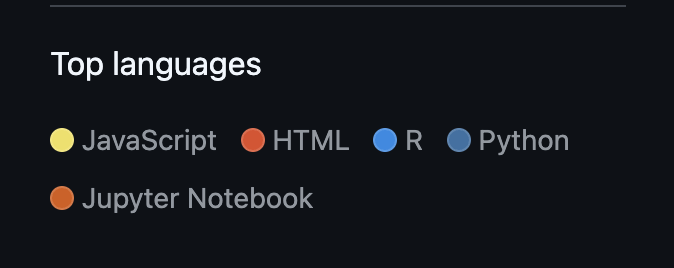

# Source and Style

## Inspecting sport data Web: FiveThirtyEight

**Website:** https://fivethirtyeight.com
**GitHub:** https://github.com/fivethirtyeight

### What web technologies were used?

I looked at the FiveThirtyEight GitHub org page first. The top languages listed are JavaScript, HTML, R, Python, and Jupyter Notebook. Those languages make a lot of sense. FiveThirtyEight is a data journalism site, so the R and Python (and Jupyter) are probably for the actual data analysis and making the charts/models. The JavaScript and HTML are for the website itself.

One thing I noticed though is that their public GitHub doesn't actually have the code for the fivethirtyeight.com website. It's mostly data repos and analysis code. So the JS and HTML in the language breakdown is probably from little interactive tools or embeddable graphics they published. I couldn't find a repo for the actual website, which makes sense because it was owned by ABC News.

I also opened DevTools on the site itself. There's a lot of JavaScript loading, and the CSS files are pretty big. I saw some file types I didn't recognize but I'm guessing a lot of it is for tracking/analytics since it's a news site.

### Who built this website?

FiveThirtyEight was founded by Nate Silver in 2008. It started as a blog, then went to the NYT, then to ABC News, then got shut down in 2023. So it wasn't just one person, there was a whole team of writers, editors, data journalists, and developers.

You can kind of tell it was a team by looking at the GitHub org. There are a lot of different repos, each one looks like it was maintained by a different person or small group. Some repos have just one main contributor, others have several. The commit history also shows a lot of different usernames, which is a dead giveaway that it was collaborative.

I couldn't find an exact number of people, but the "About" page on the site and the variety of repos suggests it was a decent-sized team, probably 20-30 people at its peak.

### Screenshots

### Links

- Website: https://fivethirtyeight.com
- GitHub org: https://github.com/fivethirtyeight